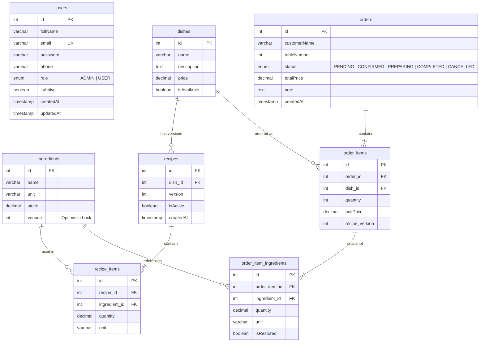

# 🍳 Cooking Management System

Hệ thống quản lý nhà bếp — quản lý nguyên liệu, món ăn, công thức, đơn hàng và nhân viên.

## Yêu cầu hệ thống

- **Docker** >= 20.x
- **Docker Compose** >= 2.x

> Không cần cài Node.js, PostgreSQL hay Redis — tất cả chạy trong Docker.

---

## Khởi chạy dự án (Docker)

### 1. Clone repository

```bash
git clone <repository-url>
cd cooking
```

### 2. Cấu hình biến môi trường

File `.env` ở thư mục gốc chứa toàn bộ cấu hình. Chỉnh sửa nếu cần:

```env
# Database
DB_PORT=5432
DB_USERNAME=phong
DB_PASSWORD=12345678
DB_DATABASE=cooking

# Redis
REDIS_PORT=6379

# Backend
APP_PORT=8080
JWT_SECRET=cooking-jwt-secret-key-2024
JWT_EXPIRES_IN=1h
NODE_ENV=production

# Frontend
FRONTEND_PORT=3000
REACT_APP_API_URL=http://localhost:8080/api
```

### 3. Khởi chạy toàn bộ hệ thống

```bash
docker compose build --no-cache
docker compose up -d
```

Lệnh trên sẽ khởi tạo 4 container:

| Container           | Mô tả                | Port         |
| ------------------- | --------------------- | ------------ |
| `cooking-postgres`  | PostgreSQL 16         | `5432`       |
| `cooking-redis`     | Redis 7               | `6379`       |
| `cooking-backend`   | NestJS API Server     | `8080`       |
| `cooking-frontend`  | React (serve)         | `3000`       |

### 4. Truy cập ứng dụng

- **Frontend**: [http://localhost:3000](http://localhost:3000)
- **Backend API**: [http://localhost:8080/api](http://localhost:8080/api)

### 5. Xem log

```bash
# Tất cả services
docker compose logs -f

# Chỉ backend
docker compose logs -f backend
```

### 6. Dừng hệ thống

```bash
docker compose down
```

Xóa toàn bộ dữ liệu (volumes):

```bash
docker compose down -v
```

---

## Tài khoản mặc định

Hệ thống tự động seed tài khoản admin khi khởi chạy lần đầu:

| Email              | Mật khẩu   | Quyền |
| ------------------ | ----------- | ----- |
| `admin@cooking.com` | `admin123` | ADMIN |

---

## Sơ đồ Database (ERD)



### Mô tả quan hệ

| Quan hệ | Mô tả |
| --- | --- |
| `dishes` → `recipes` | Mỗi món có nhiều phiên bản công thức, chỉ 1 phiên bản active |
| `recipes` → `recipe_items` | Mỗi công thức gồm nhiều nguyên liệu với số lượng cụ thể |
| `orders` → `order_items` | Mỗi đơn hàng chứa nhiều món |
| `order_items` → `order_item_ingredients` | Snapshot nguyên liệu đã dùng tại thời điểm đặt hàng |

---

## Kiến trúc hệ thống

### Tech Stack

| Layer     | Công nghệ |
| --------- | --------- |
| Frontend  | React 19, TypeScript, Tailwind CSS, Flowbite, SweetAlert2 |
| Backend   | NestJS 11, TypeScript, TypeORM |
| Database  | PostgreSQL 16 |
| Cache     | Redis 7 (lưu Refresh Token) |
| Auth      | JWT (Access Token 1h + Refresh Token 7 ngày) |
| Container | Docker, Docker Compose |

### Kiến trúc Backend (Layered Architecture)

```
Controller → Service (Interface + Impl) → Repository → Entity
     ↓
   DTO (Request/Response) + Mapper
```

Mỗi module (Ingredient, Dish, Recipe, Order, User, Auth) tuân theo cấu trúc:

```
modules/{module}/
├── controller/        # REST endpoints
├── service/
│   ├── *.service.ts        # Interface (contract)
│   └── *.service.impl.ts   # Implementation (DI token)
├── repository/        # TypeORM repository wrapper
├── entity/            # Database entity
├── dto/
│   ├── request/       # Input validation (class-validator)
│   └── response/      # Output mapping
└── mapper/            # Entity ↔ DTO conversion
```

**Dependency Injection**: Service được inject qua DI token (ví dụ: `INGREDIENT_SERVICE`), cho phép dễ dàng thay thế implementation khi cần test hoặc refactor.

### Xác thực & Phân quyền

- **JWT Strategy**: Access Token (1h) + Refresh Token (7 ngày trong Redis)
- **Global Guards**: `JwtAuthGuard` (bắt buộc auth) + `RolesGuard` (kiểm tra role)
- **Decorators**: `@Public()` cho endpoint không cần auth, `@Roles(ADMIN)` cho endpoint riêng admin
- **Refresh Token**: Lưu trong Redis với TTL, hỗ trợ revoke khi logout

---

## Xử lý System Robustness

### 1. Transaction & Tính toàn vẹn kho (Critical)

**Vấn đề**: Khi tạo/hủy đơn hàng, cần trừ/hoàn nguyên liệu. Nếu cùng một nguyên liệu xuất hiện trong nhiều món, đọc stock ngoài transaction sẽ gây **stale read** — chỉ cập nhật đúng cho item đầu tiên.

**Giải pháp**: Sử dụng `queryRunner.manager.findOne()` bên trong transaction thay vì repository bên ngoài, đảm bảo mỗi lần đọc stock đều lấy giá trị mới nhất trong cùng transaction.

```
BEGIN TRANSACTION
  → Kiểm tra stock đủ (StockCheckerService)
  → Trừ kho từng nguyên liệu (đọc lại trong transaction)
  → Lưu snapshot nguyên liệu vào order_item_ingredients
COMMIT
```

### 2. Optimistic Locking (Ingredient)

Entity `Ingredient` sử dụng `@VersionColumn()` — nếu 2 request đồng thời cập nhật cùng nguyên liệu, request thứ 2 sẽ nhận lỗi conflict thay vì ghi đè dữ liệu.

### 3. Snapshot nguyên liệu khi đặt hàng

Bảng `order_item_ingredients` lưu **snapshot** nguyên liệu đã dùng tại thời điểm tạo đơn (quantity, unit). Điều này đảm bảo:
- Dù công thức thay đổi sau đó, đơn hàng cũ vẫn biết chính xác đã dùng bao nhiêu nguyên liệu
- Khi hủy đơn, hoàn trả đúng lượng nguyên liệu đã trừ (dùng cờ `isRestored` để tránh hoàn trả trùng)

### 4. Ràng buộc nghiệp vụ (Business Rules)

| Rule | Mô tả |
| --- | --- |
| Món chưa có công thức → không thể "Có sẵn" | Ngăn order món không có cách chế biến |
| Không xóa nguyên liệu đang dùng trong công thức active | Bảo vệ tính toàn vẹn công thức |
| Không xóa nguyên liệu khi có đơn PENDING/CONFIRMED | Vì hủy đơn cần hoàn kho |
| Không đổi đơn vị nguyên liệu khi đang dùng | Tránh sai lệch tính toán kho |
| Trạng thái đơn hàng chỉ chuyển tiến | PENDING → CONFIRMED → PREPARING → COMPLETED |
| Hủy đơn chỉ cho PENDING/CONFIRMED | Đang chế biến hoặc hoàn thành không thể hủy |
